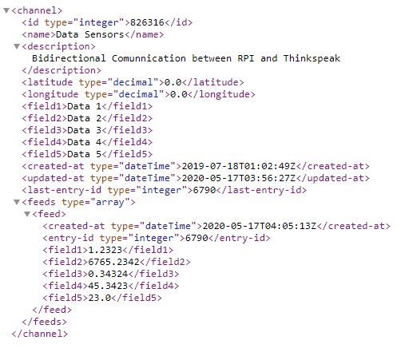

# Arduino Projects
<!-- markdownlint-disable MD033 -->
<!-- markdownlint-disable MD047 -->
## 1. Send data to ThingSpeak

This code is in the ThingSpeakSendData folder, it sends 5 data in diferents fields. The figure shows the data sent to channel in xml format.

  

## 2. Receive data of ThingSpeak

This code is in ThingSpeakSend Data, it receives data of 5 fields in xml format and it decodes it for taking only the data of previous example. The following figure shows the data in a list.

  

## 3. Receive Arduino Data with NRF24L01 antenna

This code is in NRF24L01communication, it sends a message to Arduino and receives the energy. The Arduino code is in the following link:

<https://github.com/Juanesb230/ArduinoProjects/tree/master/NRF24energy>

The next figure shows as the RPI receives the data.

  

## 7. Contact with me

Linkedin: <www.linkedin.com/in/juan-balseca-pinto-9117b397>